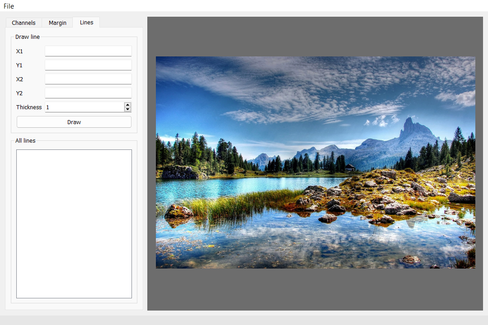

# Ознакомительная практика - Репозиторий - Карандаев Р.А. КИ23-17/1Б
## Описание

Программа, с помощью которой пользователь может менять каналы изображения, добавлять границы к картинке и рисовать зеленые линии на ней.
## Инструкция по установке
1) Установить anaconda последней версии.
2) В появившейся программе anaconda prompt прописать: `conda create --name py310 python=3.10 anaconda`.
3) Найти папку с pip (*текущий пользователь\anaconda3\envs\py310\Scripts*), открыть командную строку в ней и ввести: `pip install -r "путь до introductory_practice/requirements/pip_req.txt"`.
4) Скачать репозиторий.
## Инструкция по запуску
- Найти папку с pythonw (*текущий пользователь\anaconda3\envs\py310*), открыть командную строку в ней и ввести: `pythonw "путь до introductory_practice/introductory_practice"`.